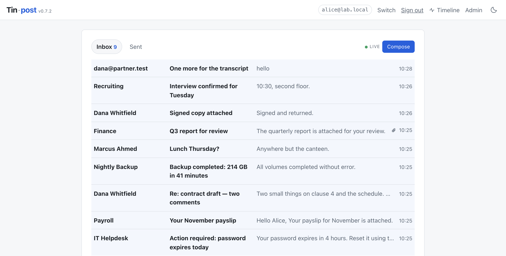
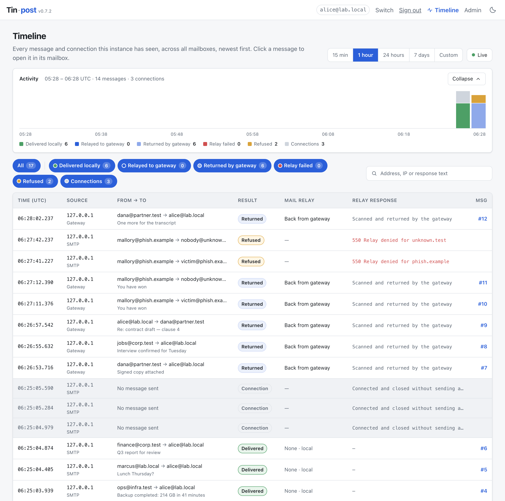
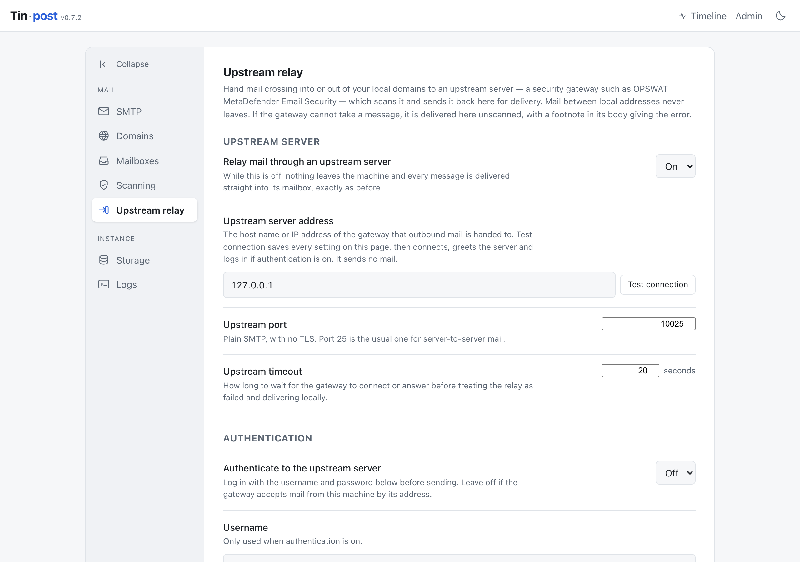
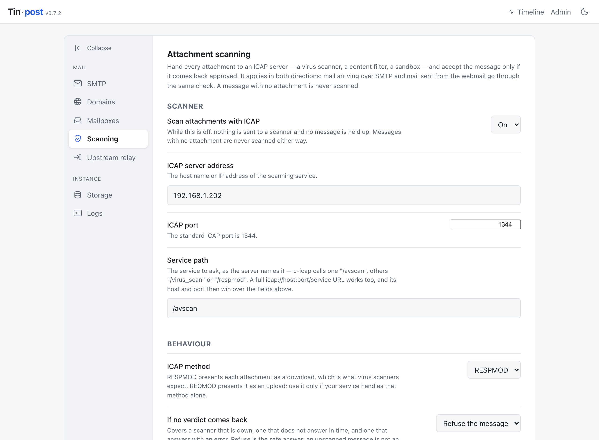
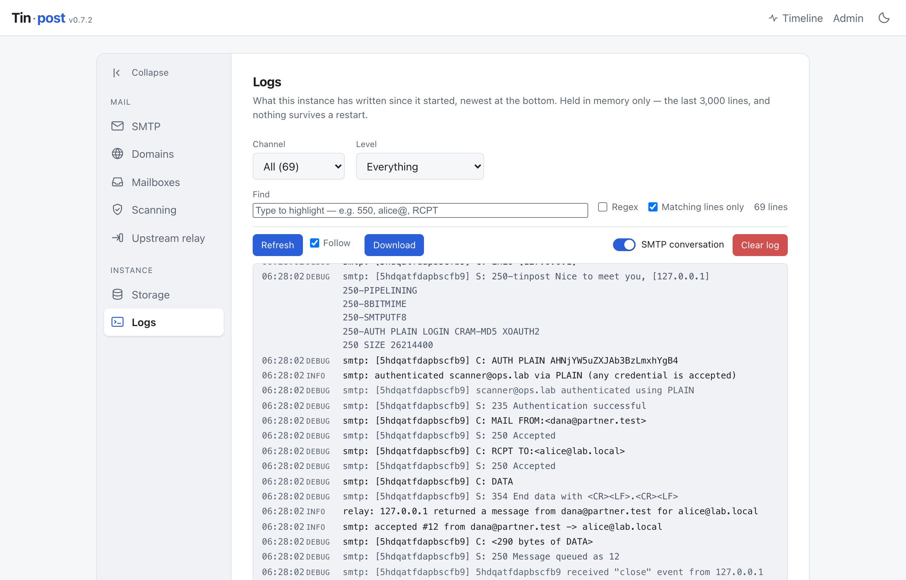

<picture>
  <source media="(prefers-color-scheme: dark)" srcset="docs/brand/tinpost-lockup-dark.png">
  
</picture>

A self-contained mail server for lab environments. It listens on SMTP, accepts mail
for any domain you point at it, and shows every mailbox in a webmail UI that anyone
can open by typing an address. You can reply and compose from the UI, and those
messages are delivered back into the same instance.

Nothing leaves the machine unless you tell it to. Out of the box there is no outbound
relay, no DNS lookup and no network call of any kind. Two integrations are opt-in and
point at your own network: [ICAP scanning](#attachment-scanning-over-icap), which sends
every attachment to a virus scanner or content filter for a verdict before the message
is accepted, and an [upstream relay](#upstream-relay), which hands whole messages to a
security gateway and takes them back once scanned.

One dependency: Node.js 22.5 or newer. Nothing compiles, there is no database to
install, and it runs the same on macOS, Windows and Linux.

## Why this was built

Testing anything that touches email is awkward. Real mail servers want DNS, TLS and
credentials before they will do anything; the hosted testing services want your data
on someone else's machine; and neither lets you watch a message being refused, scanned
or rewritten while it happens.

Tinpost exists because a lab needs mail that behaves like the real thing and goes
nowhere. It was built to rehearse phishing and security-awareness exercises with real
attachments and HTML bodies, and to sit downstream of a security gateway — OPSWAT
MetaDefender Email Security, in the lab it grew up in — so that a message can be
watched all the way through: accepted, handed to the gateway, scanned, returned and
delivered, with every SMTP command and reply readable afterwards.

It is deliberately open. There are no passwords anywhere, because a lab that makes you
manage credentials is a lab nobody uses. That is a design decision, not an oversight —
see [Security](#security).

## What it is for

- **A simple, flexible mail server for your lab environment** — one command, no DNS,
  no TLS and no credentials to arrange before mail starts flowing
- Phishing and security-awareness exercises, with real attachments and HTML bodies
- Incident-response and forensics training, where `.eml` files and full headers matter
- Testing an application's signup, password-reset or notification flows
- Exercising a security gateway or ICAP scanner, and watching what it did to a message
- Demos that need believable mail without touching anyone's real inbox

## What it is not for

**Tinpost is not a production mail server, and must not be used as one.** It is a
sink: mail comes in and stops there.

- **It never delivers real email.** There is no MX lookup, no queue and no retry. A
  message addressed to a real person at a real domain is stored in a local mailbox and
  goes nowhere. The one way anything leaves is the opt-in
  [upstream relay](#upstream-relay), and that hands mail to one server you name —
  intended to be a scanning gateway on your own network, which sends it straight back.
- **It is not a security boundary.** There are no passwords anywhere — anyone who can
  reach the web port reads every mailbox, changes every setting and deletes all the
  mail. That is deliberate, and it is why it binds to loopback by default.
- **It is not durable storage.** The mail store is meant to be thrown away between
  exercises — the admin page has a Purge control that deletes every message, and
  there are no backups.
- **Do not put it on the internet**, or on any network you do not control. Use
  `--host 0.0.0.0` only on an isolated lab network.

If you need mail that actually reaches people, you need a real MTA — Postfix, Exim, or
a hosted provider. Tinpost is for the part of the work where you specifically do not
want that.

Tinpost is for **authorised testing in environments you control** — your own machines
and lab networks, or a client's systems where you have permission to do the work.
[SECURITY.md](SECURITY.md) says what that means, what Tinpost deliberately does not
protect, and how to report a vulnerability.

## Features

- **Mail sink** — accepts mail for any domain over SMTP and stores it instead of
  forwarding it, so nothing reaches a real inbox.
- **Webmail** — open any mailbox by typing its address, with no password, and read,
  reply, compose and download `.eml` files from the browser.
- **Timeline** — every message and connection the instance has seen, across all
  mailboxes, on one page with an activity chart, filters and search.
- **Live view of connections** — a Logs page that tails the server's own output as it
  is written, and can record the full SMTP conversation, every `C:` and `S:` line,
  tagged per connection.
- **ICAP support** — hand every attachment to a virus scanner or content filter and
  accept the message only if it comes back approved.
- **Upstream relay** — route mail crossing your local domain boundary through a
  security gateway, which scans it and sends it back for delivery.
- **Accepts any credentials** — advertises `AUTH` and accepts any username, password
  or token, so clients that refuse to talk to a server without it still connect.
- **Domain policy** — accept every domain as a catch-all, or restrict to an allowlist
  and watch unlisted recipients get a realistic `550`.
- **Realistic refusals** — size, recipient and connection limits that answer with the
  same SMTP codes a real MTA would, so a client under test sees a real failure.
- **Safe by construction** — HTML bodies render in a sandboxed frame with no scripts
  and no network access, and attachments always download rather than execute.

## Installing

Tinpost is not published to the npm registry. Install it from the repository.

### macOS

```bash
brew install node          # if you do not have Node 22.5+ already
git clone https://github.com/cventour/tinpost.git
cd tinpost
npm ci
npm start
```

### Windows (PowerShell)

```powershell
winget install OpenJS.NodeJS.LTS    # if you do not have Node 22.5+ already
git clone https://github.com/cventour/tinpost.git
cd tinpost
npm ci
npm start
```

Either way it prints where it is listening:

```
  Webmail   http://127.0.0.1:8025
  Admin     http://127.0.0.1:8025/admin   (no password)
  SMTP      127.0.0.1:2525   (any credentials, no TLS)
```

Open the webmail URL, type any address — `alice@lab.local` will do — and you are in
that mailbox. Stop it with `Ctrl+C`.

To get a `tinpost` command on your PATH instead of `npm start`, run `npm install -g .`
from the checkout. On Windows that creates `tinpost.cmd`, so `tinpost serve` works in
PowerShell and `cmd.exe` alike.

### Send it a test message

macOS or Linux:

```bash
node -e "const n=require('nodemailer');n.createTransport({host:'127.0.0.1',port:2525}).sendMail({from:'bob@corp.test',to:'alice@lab.local',subject:'Hello',text:'First message.'})"
```

Windows (PowerShell) — works on macOS too:

```powershell
$smtp = [System.Net.Mail.SmtpClient]::new('127.0.0.1', 2525)
$smtp.Send('bob@corp.test', 'alice@lab.local', 'Hello', 'First message.')
```

It appears in the open page within a second, without a reload.

## Running it

Stop it with `Ctrl+C`. If you installed globally, write `tinpost serve` wherever these
say `node src/cli.js serve`.

### macOS and Linux

```bash
npm start                                              # defaults: SMTP 2525, web 8025
node src/cli.js serve --smtp-port 2525 --http-port 8025  # choose the ports
node src/cli.js serve --host 0.0.0.0                   # reachable from other machines
node src/cli.js serve --data-dir ~/labmail             # keep the mail somewhere specific
sudo node src/cli.js serve --smtp-port 25 --data-dir /usr/local/var/tinpost
```

### Windows (PowerShell)

```powershell
npm start                                                 # defaults: SMTP 2525, web 8025
node src\cli.js serve --smtp-port 2525 --http-port 8025    # choose the ports
node src\cli.js serve --host 0.0.0.0                      # reachable from other machines
node src\cli.js serve --data-dir C:\labmail               # keep the mail somewhere specific
node src\cli.js serve --smtp-port 25                      # no elevation needed on Windows
```

Exposing it with `--host 0.0.0.0` on Windows also needs a firewall rule — see
[Keeping it running](#windows--task-scheduler).

### Port 25 needs root — except on Windows

Ports below 1024 are reserved for root on macOS and Linux. That is a rule of those
systems, not a choice Tinpost makes, and it is why the default is 2525.

| | Default port 2525 | Standard port 25 |
|---|---|---|
| macOS | ordinary user | **`sudo` required** |
| Linux | ordinary user | **`sudo` required**, or grant `CAP_NET_BIND_SERVICE` |
| Windows | ordinary user | ordinary user — Windows does not reserve low ports |

Run as root with no port flag at all and Tinpost takes 25 by itself, because running
as root is read as intent to be a real mail server. Run as an ordinary user on macOS
or Linux and it falls back to 2525 and says why, on the entry page and in the log. It
never refuses to start over this.

**Pass `--data-dir` whenever you use `sudo`.** Under `sudo` the default location
resolves against root's environment rather than yours, so a sudo run and an ordinary
run would otherwise keep two separate mail stores, each looking empty to the other.
Anything written under `sudo` also belongs to root, so a later ordinary run cannot
delete it.

On Linux there is a third way, and it is the one the reference deployment uses: leave
the process unprivileged and grant the one capability it needs. See the systemd unit
under [Keeping it running](#linux--systemd).

## Parameters

```
tinpost serve [options]
```

| Option | What it does |
|---|---|
| `--http-port <n>` | Port for the web interface and admin page. Default 8025. |
| `--smtp-port <n>` | Port senders connect to. Default 2525. |
| `--host <addr>` | Address to bind. Default `127.0.0.1`; use `0.0.0.0` to reach it from other machines. |
| `--data-dir <path>` | Where the database and stored mail live. |
| `--max-size <bytes>` | Largest message accepted. Default 25 MB. |
| `-h`, `--help` | Show the options and exit. |
| `-v`, `--version` | Show the version and exit. |

Each has an environment variable equivalent: `TINPOST_HTTP_PORT`,
`TINPOST_SMTP_PORT`, `TINPOST_HOST`, `TINPOST_DATA_DIR`, `TINPOST_MAX_SIZE`.

Most settings — limits, ports, server name, scanning and relay — can also be changed
on the admin page. A value given on the command line always wins.

**Port 25 needs root on macOS and Linux**, because those systems reserve ports below
1024. Windows does not reserve them, so an ordinary account binds 25 there with no
elevation. See [Port 25](#port-25-needs-root--except-on-windows).

## How it looks

**Inbox** — open a mailbox by typing its address. New mail arrives without a reload.



**Timeline** — every message and connection across all mailboxes, with an activity
chart, one filter per outcome, and search. Click a message to open it.



**Upstream relay** — hand mail crossing your domain boundary to a security gateway,
which scans it and sends it back.



**Attachment scanning** — send every attachment to an ICAP server and accept the
message only if it comes back approved. Configurable per domain as well as globally.



**Logs** — the server's own output, live, with the full SMTP conversation recorded per
connection. What the sender said and what Tinpost answered are toned differently.



## What changed

Every release is written up in plain language in [CHANGELOG.md](CHANGELOG.md), newest
first — what changed for someone running a lab, and what a fix looked like from their
side. Versioning follows [semantic versioning](VERSIONING.md).

---

## Sending mail to it

Point any client or library at `127.0.0.1:2525`. There is no TLS, because lab senders
are scripts on loopback. `AUTH` is offered and accepts any credential at all, but is
never required — see [Authentication](#authentication).

Node:

```js
import nodemailer from 'nodemailer';

const transport = nodemailer.createTransport({ host: '127.0.0.1', port: 2525, secure: false });

await transport.sendMail({
  from: '"IT Helpdesk" <helpdesk@corp.test>',
  to: 'alice@lab.local',
  subject: 'Action required',
  html: '<p>Please review the <b>attached</b> report.</p>',
  attachments: [{ filename: 'report.pdf', path: './report.pdf' }],
});
```

Python:

```python
import smtplib
from email.message import EmailMessage

msg = EmailMessage()
msg["From"] = "helpdesk@corp.test"
msg["To"] = "alice@lab.local"
msg["Subject"] = "Action required"
msg.set_content("Please review the attached report.")
msg.add_attachment(open("report.pdf", "rb").read(),
                   maintype="application", subtype="pdf", filename="report.pdf")

with smtplib.SMTP("127.0.0.1", 2525) as s:
    s.send_message(msg)
```

An application under test usually just needs its SMTP settings pointed at
`127.0.0.1:2525` with authentication and TLS turned off.

## Reading mail

Type an address on the entry page and you are reading that mailbox. There is no
password, because in a lab the whole point is that anyone can look at any mailbox.
A mailbox is not something you create: it exists as soon as mail is addressed to it.

Addresses this instance has already seen complete as you type. With one candidate the
rest of the address fills in and stays selected, so carrying on typing replaces it;
with several, they are listed and the arrow keys pick one. A new address is never
harder to enter than an existing one.

Each message can be read three ways:

- **HTML** — rendered in a sandboxed frame with scripts disabled and every network
  source blocked. Inline `cid:` images are embedded directly, so embedded graphics
  still display while nothing is fetched from outside.
- **Plain text** — the text part, or a readable rendering of the HTML when the
  message has no text part.
- **Source** — the full original message, headers and all, with a **Download .eml**
  button for feeding it into another tool.

Attachments are listed with their type and size and always download; they are never
rendered or executed in the browser. That matters when the lab scenario deliberately
involves a hostile file.

The inbox updates on its own as mail arrives, using a server-sent event stream with a
polling fallback.

## Sending from the webmail

Compose and Reply work from any mailbox you are reading. Recipients can be on any
domain the accept policy allows, and delivery is internal — the message simply lands
in the recipient's mailbox on the same instance. You can attach files, and choose
whether the body is sent as plain text or HTML (a plain-text alternative is generated
either way, so the message is readable in both views).

Mail composed in the UI goes through exactly the same delivery path as mail that
arrived over SMTP, so it is stored as a genuine RFC822 message and is
indistinguishable from received mail.

## Timeline

**Timeline**, beside Admin in the top bar, shows everything the instance has seen,
across every mailbox, newest first: each message stored, each message relayed to or
returned by the upstream gateway, each relay failure, each refusal (`550`, `552` and
the like), and each connection that came and went without sending anything.

- A small activity chart sits above the table, one bar per slice of the window,
  coloured by what happened. **Collapse** folds it to a single line; the page
  remembers that per browser.
- Pick the window: 15 minutes, 1 hour, 24 hours, 7 days, or **Custom** with a start
  and an end. Every time on the page is UTC.
- The pills under the chart are on/off switches, one per category and colour:
  Delivered locally, Relayed to gateway, Returned by gateway, Relay failed (the
  gateway said no or could not be reached), Refused (Tinpost itself said no — `550`,
  `552`, a scanner verdict) and Connections. Turn one off and its rows and its colour
  on the chart disappear; **All** turns every one back on. Everything that touched
  the gateway is Relayed + Returned + Relay failed. Search by address, IP, subject or
  response text as well.
- Each row gives the time to the millisecond, the source IP and whether it came in
  over SMTP, from the webmail or from the gateway, sender and recipients, the result,
  whether the relay was involved and which way, and the relay's exact reply.
- **Click a message to open it.** Tinpost switches to a mailbox that holds it — the
  recipient's, or the sender's while the gateway still has it — and shows it in the
  ordinary message view, ready to reply to or download.
- While the window ends now, new events are announced as a count to show, rather
  than pushed into the table under your cursor.

The timeline is stored in the database, so it survives a restart. Mail stored before
v0.7.0 is added to it once, on the first start, without the details that were not
recorded then. **Purge everything** on the Storage page clears it too.

## Admin

`/admin` has no password. Gating it would protect nothing: the mailboxes beside it are
already readable by anyone who can reach the web port, so the honest answer is to bind
to loopback and say so plainly rather than put a lock on one of two open doors.

From there you can:

- Switch between **any domain** (catch-all) and **allowlist only**, and manage the
  list of accepted domains. Under the allowlist, other domains are refused at the
  SMTP layer with a `550`, exactly as a real MTA would, so a client under test sees a
  realistic failure. The compose form honours the same rule.
- Point Tinpost at an **ICAP server** and have every attachment scanned before a
  message is accepted &mdash; see below.
- Send outbound mail through an **upstream relay**, such as an email security
  gateway, and take it back once scanned &mdash; see below.
- See every mailbox with its message counts, open one, or delete its mail.
- See how much disk the stored files use, reclaim space, or purge everything to reset
  the lab between runs.
- Read the server's own log, and follow it live &mdash; see below.

## Logs

**Admin ▸ Logs** shows what the instance has written since it started: the raw
lines, newest at the bottom, with a find box that highlights every match as you type
and hides everything else until you clear it. Plain text by default, or tick
**Regex** for a pattern. Channel (SMTP, Scanning, Admin, Web) and level are query
parameters, so a filtered view can be bookmarked and shared, and the page works with
JavaScript switched off.

**Follow** tails the log while you watch, asking only for lines newer than the last
one on screen. **Refresh** pulls the newest lines without reloading, so whatever you
have typed in the find box survives. **Download** saves what is on screen as a plain
`.log` file, and **Clear log** empties the buffer when the last hour is no longer
interesting.

The log is held in memory only &mdash; the last 3,000 lines, and nothing survives a
restart. A lab instance is started, used and thrown away; a file on disk would have
to be rotated, permissioned and cleaned up to answer a question that the last few
thousand lines already answer.

Every connection is logged as it arrives, whether or not anything is then sent: a
sender that connects and gets no further still leaves `smtp: connection from …` and
`… closed without sending a message`, which is usually the whole diagnosis.

In the action bar is a pill switch for the **SMTP conversation**: with it on, every command
and reply is recorded &mdash; `C: MAIL FROM:<…>`, `S: 250 Accepted` and the rest
&mdash; tagged with the connection it belongs to so overlapping senders stay apart.
It is off by default because it is several lines per command, and it is only ever
written to this page, never to the terminal.

## Authentication

There is nothing to authenticate to: every mailbox is readable by anyone who can
reach the web port, by design. But a sender that finds no `AUTH` advertised may
simply hang up rather than deliver, and then the lab cannot receive the mail it
exists to receive. So Tinpost advertises `AUTH` and accepts **anything at all** —
any username, any password, any token, over `PLAIN`, `LOGIN`, `CRAM-MD5` or
`XOAUTH2`. It proves nothing, and is not meant to.

Authentication is never *required*. A sender that skips it is accepted exactly as
before, so nothing that worked yesterday stops working. The username offered is
written to the log, which is often the fastest way to catch a client that
authenticates as one identity and then puts something else in `MAIL FROM`.

Turn the offer off under **SMTP ▸ Authentication** on the admin page if you want to
test how a client behaves against a server that refuses it.

`STARTTLS` is still not offered. A lab sender would need a certificate it could
trust, and issuing one for a `.lab` name is a great deal of ceremony for a server
whose whole point is that nothing about it is secret.

## Keeping it running

Nothing below is required — `npm start` in a terminal is a perfectly good way to run
a lab for an afternoon, and Tinpost needs no service manager. These are only for when
you want it back after a reboot. Each uses what the platform already ships; none
needs extra software.

Replace `/path/to/tinpost` and the Node path with your own. `node --version` and
`which node` (`Get-Command node` on Windows) will tell you them.

### macOS — launchd

Save as `~/Library/LaunchAgents/local.tinpost.plist`:

```xml
<?xml version="1.0" encoding="UTF-8"?>
<!DOCTYPE plist PUBLIC "-//Apple//DTD PLIST 1.0//EN" "http://www.apple.com/DTDs/PropertyList-1.0.dtd">
<plist version="1.0">
<dict>
  <key>Label</key><string>local.tinpost</string>
  <key>ProgramArguments</key>
  <array>
    <string>/opt/homebrew/bin/node</string>
    <string>/path/to/tinpost/src/cli.js</string>
    <string>serve</string>
  </array>
  <key>RunAtLoad</key><true/>
  <key>KeepAlive</key><true/>
  <key>StandardOutPath</key><string>/tmp/tinpost.log</string>
  <key>StandardErrorPath</key><string>/tmp/tinpost.log</string>
</dict>
</plist>
```

```bash
launchctl load ~/Library/LaunchAgents/local.tinpost.plist
```

`launchctl unload` the same path to stop it. A LaunchAgent runs as you, so it cannot
bind port 25; leave the SMTP port at 2525, or use a LaunchDaemon in
`/Library/LaunchDaemons` if you need the standard port.

### Windows — Task Scheduler

Built into Windows, so there is nothing to install. From an elevated PowerShell:

```powershell
$node = (Get-Command node).Source
$action  = New-ScheduledTaskAction -Execute $node -Argument 'C:\path\to\tinpost\src\cli.js serve' -WorkingDirectory 'C:\path\to\tinpost'
$trigger = New-ScheduledTaskTrigger -AtStartup
$settings = New-ScheduledTaskSettingsSet -RestartCount 3 -RestartInterval (New-TimeSpan -Minutes 1)
Register-ScheduledTask -TaskName 'Tinpost' -Action $action -Trigger $trigger -Settings $settings -User 'SYSTEM' -RunLevel Highest
Start-ScheduledTask -TaskName 'Tinpost'
```

`Stop-ScheduledTask -TaskName 'Tinpost'` stops it; `Unregister-ScheduledTask` removes
it. Windows does not reserve ports below 1024, so an ordinary account can bind port 25
there — `-User 'SYSTEM'` is only so the task runs with nobody logged in.

You will likely need a firewall rule before another machine can reach it:

```powershell
New-NetFirewallRule -DisplayName 'Tinpost SMTP' -Direction Inbound -Protocol TCP -LocalPort 2525 -Action Allow
New-NetFirewallRule -DisplayName 'Tinpost web'  -Direction Inbound -Protocol TCP -LocalPort 8025 -Action Allow
```

### Linux — systemd

Save as `/etc/systemd/system/tinpost.service`:

```ini
[Unit]
Description=Tinpost lab mail server
After=network-online.target
Wants=network-online.target

[Service]
Type=simple
User=tinpost
WorkingDirectory=/path/to/tinpost
ExecStart=/usr/bin/node /path/to/tinpost/src/cli.js serve --host 0.0.0.0 --data-dir /var/lib/tinpost
Restart=on-failure
NoNewPrivileges=true
ProtectSystem=strict
ProtectHome=true
ReadWritePaths=/var/lib/tinpost

[Install]
WantedBy=multi-user.target
```

```bash
sudo systemctl enable --now tinpost
```

To take port 25 without running as root, add `AmbientCapabilities=CAP_NET_BIND_SERVICE`
and `CapabilityBoundingSet=CAP_NET_BIND_SERVICE` to the `[Service]` block, then
`--smtp-port 25` to `ExecStart`. Debian's standard image enables `postfix` on
`127.0.0.1:25`, which will hold the port — `systemctl disable --now postfix` first.

## Attachment scanning over ICAP

Tinpost can hand every attachment to an ICAP server — a virus scanner such as c-icap
with ClamAV, a commercial content filter, a sandbox — and accept the message only if
it comes back approved. The same check covers both directions: mail arriving over
SMTP and mail sent from the webmail go through it.

Turn it on under **Scanning** on the admin page and give it the address, port and
service path of your ICAP server (the standard port is 1344; c-icap typically calls
its scanning service `/avscan`). The field also accepts a whole
`icap://host:port/service` URL, which then supplies the host and port itself. "Test
the connection" sends an ICAP `OPTIONS` request and reports what the service says it
supports, without sending any mail.

What happens then:

- A message **with no attachment is never scanned**. There is nothing for a scanner
  to look at, and no message is delayed for one. Inline images count as attachments
  here: they are files a message carries, whatever a mail client chooses to show.
- Each attachment is sent on its own, as a `RESPMOD` request (or `REQMOD` if that is
  all your service does), wrapped in the synthetic HTTP message the protocol requires.
  `Preview` is supported: set one and only the first N bytes go over first, with the
  rest following if the scanner asks for them.
- The verdict is read from the `X-Response-Info` header where the scanner sets one,
  because the status line is not reliable across products: MetaDefender ICAP Server
  answers `RESPMOD` with a `200` whether it refused the file or merely rewrote it, and
  reserves `403` for a method Tinpost does not use. Where there is no such header, a
  `204` is clean, a `403` is a refusal, and a `200` carrying replacement content is
  read as one too.
- A refusal stops the message. Over SMTP the sender gets a `550` naming the threat and
  the file; from the webmail the compose form says the same and keeps the draft.
- A file the scanner **sanitised or redacted** rather than refused is approved, and is
  delivered. Tinpost stores mail exactly as it arrived and has nowhere to put a
  rewritten MIME part, so what lands is the original, not the scanner's cleaned copy —
  and the log says so on every such message.
- If **no verdict comes back** — the scanner is down, times out, or returns an error —
  the default is to refuse the message, and you can switch that to deliver anyway,
  which is then said plainly in the log. A scanner that is merely unreachable gets a
  `451`, a real MTA's "come back later". A **misconfiguration** gets a `550` instead:
  a wrong service path or an unsupported method will not fix itself on a retry, and
  answering `451` would hide the fault behind a queue that never drains. The message
  names the fix.
- Nothing is written to a mailbox until the verdict is in, so a refused message never
  appears anywhere. Its raw file is cleaned up by the next pass of "Reclaim space".

Scanning is configured **per domain** as well. Each domain can be set to scan, not to
scan, or to follow the global default, and a message is scanned when either side asks
for it — the sender's domain or any recipient's — so one entry covers a domain's mail
in both directions.

## Upstream relay

**Admin ▸ Upstream relay** hands mail crossing into or out of your local domains to
another SMTP server — in practice a security gateway such as OPSWAT MetaDefender Email
Security — which scans it and sends it back to Tinpost's SMTP port for delivery. Give it the gateway's host and port,
optionally a username and password, and the list of **local domains**. It speaks plain
SMTP; there is no TLS.

How each message is routed:

| Message | What happens |
|---|---|
| From a local domain to a **local** domain | Internal mail. Delivered directly, never leaves. ICAP scanning applies as usual. |
| From a local domain to a domain that is **not local** | Handed to the gateway. The sender's copy is marked *relayed, awaiting scan*; the recipients get it when the gateway sends it back. Tinpost's own ICAP scan is skipped. |
| From a domain that is not local **to a local domain** | Handed to the gateway too, whether it was written in the webmail or arrived over SMTP. The local recipients get it when the gateway sends it back. |
| Sent back by the gateway | Delivered to the recipients it was relayed for, and never relayed again. |
| Gateway unreachable, or it refuses the message | Delivered locally **without scanning**, with a footnote in the body giving the error, SMTP reply included. |
| Between two domains that are **not local** | Delivered directly. ICAP scanning applies as usual. |

A message addressed to both kinds of recipient is split: local recipients of a local
sender get it straight away, and everyone else gets it through the gateway. Mail that
the gateway itself delivers to Tinpost — including inbound mail it has already
scanned — is recognised by its address and delivered directly, never sent round again.

Tinpost recognises the gateway's returned mail by the address it connects from, not by
anything in the message, because a sender cannot forge its source address. Under
**Gateway return addresses**, list the IP addresses or host names the gateway sends
from; leave the field empty if that is the same address it listens on. Every message
handed to the gateway is stamped with an `X-Tinpost-Relayed` header. If one comes back
from an address that is not listed, Tinpost refuses it with `554` as a mail loop and
logs which setting to fix, rather than relaying it forever.

There is no queue. A message the gateway cannot take is delivered, not retried, so
"Test the connection" is worth pressing before a session: it connects, greets and logs
in, and sends nothing. Relay activity is under the **Relay** channel on the Logs page.

Mail on its way out is accepted even under the allowlist policy, since the allowlist
is about which domains Tinpost hosts, and outbound recipients are not hosted here.

Anything that sends straight to Tinpost's SMTP port from a domain that is not local
into a local one goes through the gateway as well. A product whose notifications come
from a local address — `mdcore@ops.lab` writing to `admin@ops.lab` — is internal mail
and is delivered directly.

## Where the data goes

The data directory holds a small SQLite file and a `blobs/` directory:

```
~/.tinpost/
  tinpost.db     index only: who sent what, to whom, when
  blobs/            the actual bytes: raw messages, HTML parts, attachments
```

The database stays an index and never grows large — after delivering a 10 MB
attachment it is still a few kilobytes, because the bytes are on the filesystem. That
keeps it fast, keeps `du -sh` honest about how much disk the lab is using, and lets
you back up or wipe the store with ordinary file tools. Files are named by the SHA-256
of their content, so the same attachment sent to ten mailboxes is stored once, and an
attacker-chosen filename never touches a path.

On Windows the default is `%LOCALAPPDATA%\Tinpost`.

You can move it from **Admin ▸ Storage** rather than passing `--data-dir` every time.
The location is remembered in a small pointer file — `~/.config/tinpost/datadir`, or
`%APPDATA%\Tinpost\datadir` on Windows — because it cannot be kept in the database
that lives inside the directory it names. Moving copies nothing: the new location
starts empty unless it already holds a lab, and the old mail stays where it is. A
`--data-dir` flag overrides the saved location for that run.

## Security

This is a lab tool, and it is deliberately open: **there are no passwords anywhere.**
Anyone who can reach the web port can read every mailbox, change the settings and
delete all the mail. That is the feature, not an oversight — a lab that makes you
manage credentials is a lab nobody uses. It binds to `127.0.0.1` by default for that
reason. Use `--host 0.0.0.0` only on an isolated lab network; the admin page and the
startup log both warn you when it is in effect.

Within that model, the reader is protected from the mail:

- HTML bodies render in a sandboxed frame with no scripts and a CSP denying every
  network source, so a message cannot run code or call home
- Attachments are always served as downloads with a neutral content type and
  `nosniff`, so nothing executes in the browser
- Stored files are named by content hash, so hostile filenames cannot traverse paths
- Sender-chosen text sent to an ICAP server (attachment names, addresses, subject)
  is stripped of line breaks and quotes, so a hostile message cannot forge a
  protocol header
- The upstream relay password is stored in the Tinpost database as typed and is
  never shown on the page again. The relay uses plain SMTP, so it and every relayed
  message cross the network unencrypted — keep the gateway on the lab network

Do not put real credentials or real personal data into it, and do not expose it to an
untrusted network. [SECURITY.md](SECURITY.md) covers intended use, what is in and out
of scope for a vulnerability report, and how to send one privately.

## Development

```bash
npm install
npm test          # 58 tests, no network access required
npm start         # runs the server from source
```

## Versioning

Tinpost follows Semantic Versioning and is in the `0.x` series. See
[VERSIONING.md](VERSIONING.md) for what each number means and how a release is cut,
and [CHANGELOG.md](CHANGELOG.md) for what has changed.

## Licence

[MIT](LICENSE) — use it, change it, ship it, with no warranty and no liability.

The licence grants permission; it does not describe what Tinpost is built for or what
it deliberately leaves unprotected. [SECURITY.md](SECURITY.md) does both, and is worth
reading before you point it at anything.
